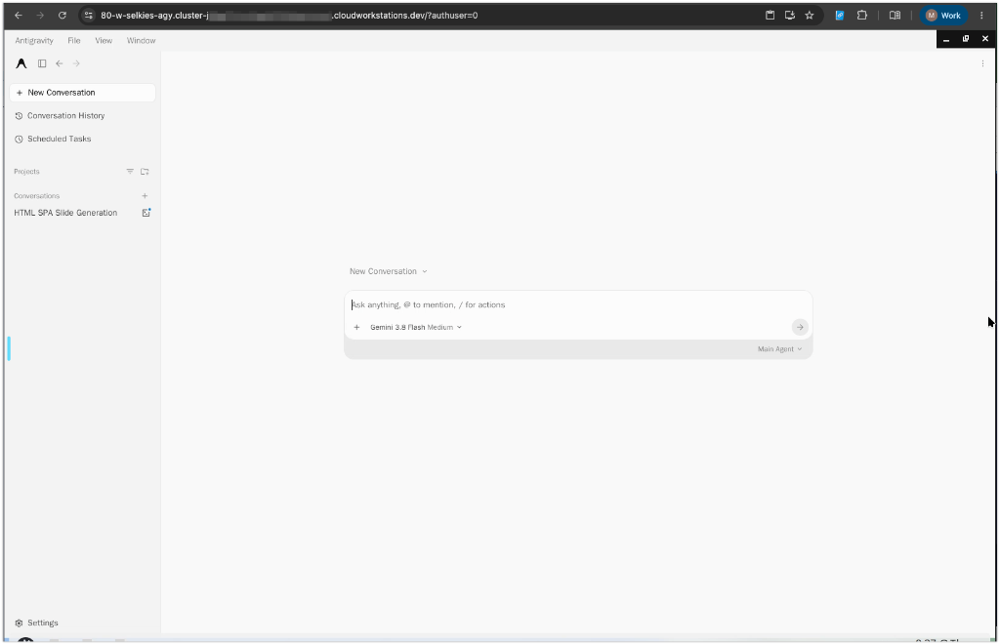
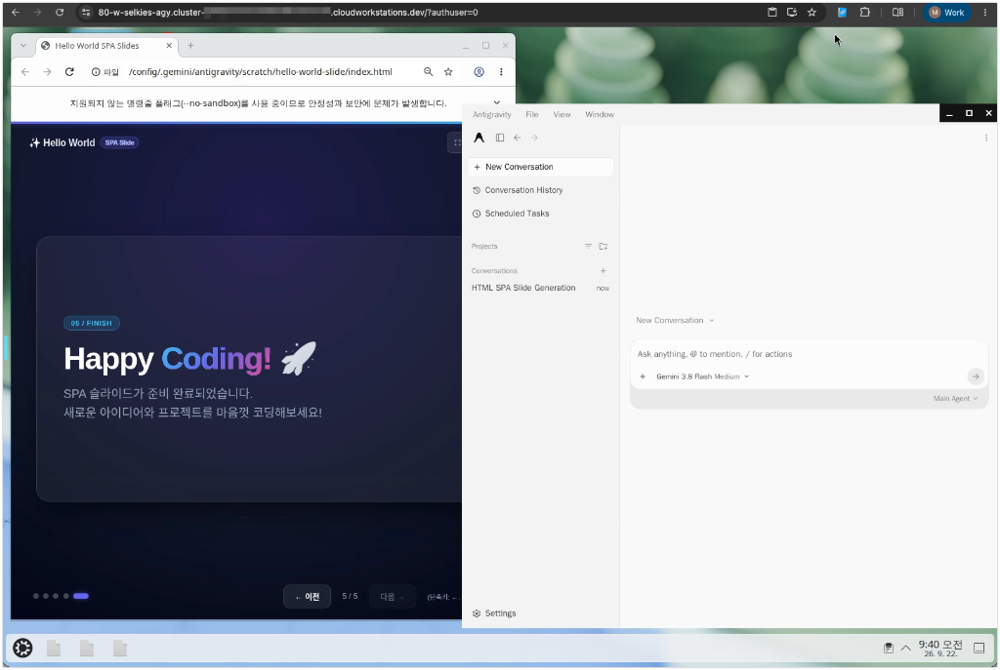

# Google Antigravity 2.0 on Cloud Workstations (Selkies Webtop)

Qwiklabs의 **`vm-antigravity` (LinuxServer.io Selkies Webtop + Wayland + Google Antigravity 2.0)** 이미지를 확장하여, Google Cloud Workstations에서 60fps 저지연 화면 스트리밍, 한/영 전환(`fcitx5-hangul`), Chrome OAuth 자동 로그인, `/dev/shm` 메모리 확장(`4GB`)을 지원하는 커스텀 워크스테이션 배포 가이드입니다.

---

| Antigravity 2.0 메인 실행 화면 | Antigravity + Chrome (`index.html`) 동시 실행 화면 |
| :---: | :---: |
|  |  |

---

## 1. 디렉토리 및 파일 구조

```text
selkies-agy/
├── assets/                                 # README 실행 화면 캡처 이미지
├── .env.example                            # 환경변수 템플릿 파일 (개인/프로젝트 정보 제외)
├── .env                                    # 실제 배포 환경변수 설정 파일 (.gitignore 처리됨)
├── Dockerfile                              # Selkies Webtop + Antigravity 2.0 + 한글 폰트/입력기 커스텀 이미지 정의
├── custom-cont-init.d/
│   └── 10-setup-antigravity.sh             # 컨테이너 부팅 시 자동 실행 (Port 80/3000, /dev/shm 4GB, Chrome 연동, 바탕화면 아이콘)
├── cloudbuild.yaml                         # Cloud Build 기반 컨테이너 이미지 빌드 및 Artifact Registry 푸시 설정
├── deploy-workstation.sh                   # .env 기반 원클릭 이미지 빌드 + Configuration 생성 + Workstation 기동 스크립트
└── README.md                               # 빌드 및 배포 가이드 문서
```

---

## 2. `.env` 환경변수 구성

[`selkies-agy/.env.example`](./.env.example) 파일을 복사하여 `.env` 파일을 생성하고 대상 GCP 프로젝트와 리소스 이름을 지정합니다.

```bash
cp .env.example .env
```

```env
PROJECT_ID="<YOUR_GCP_PROJECT_ID>"
REGION="<YOUR_GCP_REGION>"
CLUSTER="<YOUR_WORKSTATION_CLUSTER_NAME>"
CONFIG_NAME="<YOUR_WORKSTATION_CONFIG_NAME>"
WORKSTATION_NAME="<YOUR_WORKSTATION_NAME>"

# Optional overrides
REPO_NAME="<YOUR_ARTIFACT_REGISTRY_REPO>"
IMAGE_NAME="<YOUR_IMAGE_NAME>"
MACHINE_TYPE="e2-standard-8"
```

설정한 `.env`를 현재 쉘에 로드하면 아래의 모든 명령어를 그대로 복사해 실행할 수 있습니다:

```bash
set -a && source .env && set +a
```

---

## 3. 사전 준비 (Artifact Registry & Workstation Cluster 생성)

이미 리포지토리와 클러스터가 존재한다면 이 단계는 건너뛰어도 됩니다.

### 3.1 Artifact Registry Docker 저장소 생성
```bash
gcloud artifacts repositories create "${REPO_NAME}" \
  --repository-format=docker \
  --location="${REGION}" \
  --project="${PROJECT_ID}"
```

### 3.2 Cloud Workstations Cluster 생성
*(최초 생성 시 약 5~8분 소요)*
```bash
gcloud workstations clusters create "${CLUSTER}" \
  --project="${PROJECT_ID}" \
  --region="${REGION}" \
  --network="projects/${PROJECT_ID}/global/networks/default" \
  --subnetwork="projects/${PROJECT_ID}/regions/${REGION}/subnetworks/default"
```

---

## 4. 단계별 구축 가이드

### Step 1. Workstation 커스텀 컨테이너 이미지 빌드 (`Cloud Build`)

[`cloudbuild.yaml`](./cloudbuild.yaml)과 [`Dockerfile`](./Dockerfile)을 사용하여 이미지를 빌드하고 Artifact Registry(`${REGION}-docker.pkg.dev/${PROJECT_ID}/${REPO_NAME}/${IMAGE_NAME}:latest`)에 Push합니다.

```bash
gcloud builds submit \
  --config=cloudbuild.yaml \
  --project="${PROJECT_ID}" \
  --substitutions="_REGION=${REGION},_REPO_NAME=${REPO_NAME},_IMAGE_NAME=${IMAGE_NAME}" \
  .
```

---

### Step 2. Custom Image로 Workstation Configuration 생성

GCP 콘솔(`Environment settings`) 기준 실제 구성된 설정값은 아래와 같습니다.

#### 2.1 GCP 콘솔 기준 Configuration 설정값 (`Environment settings`)

| 콘솔 섹션 | 설정 항목 | 설정값 | 비고 |
| :--- | :--- | :--- | :--- |
| **Machine configuration** | **Machine type** | `e2-standard-8` (또는 `e2-standard-4`) | 다수 실습용은 `e2-standard-4` 권장 |
| **Environment settings** | **Container image URL** | `<REGION>-docker.pkg.dev/<PROJECT_ID>/<REPO_NAME>/<IMAGE_NAME>:latest` | Step 1에서 빌드한 이미지 경로 |
| **Environment settings** | **Service account** | `<PROJECT_NUMBER>-compute@developer.gserviceaccount.com` | **필수**: 미지정 시 이미지 Pull `403 Forbidden` 발생 |
| **Storage settings** | **Attach a persistent disk** | `No` | 실습용 임시 환경 (재시작 시 최신 이미지 클린 부팅) |
| **Storage settings** | **Attach an ephemeral disk** | `No` | 기본 부트 디스크(50GB) 사용 |
| **Advanced container options** | **Run as user** | `0` | **필수**: `s6-overlay`(`/init`) 초기화를 위해 root(`0`)로 시작 후 내부 데스크톱은 `abc` 유저로 구동 |
| **Advanced container options** | **Environment variables** | `CUSTOM_PORT: 80`<br>`PIXELFLUX_WAYLAND: true`<br>`SELKIES_ENCODER: x264enc,jpeg`<br>`LANG: ko_KR.UTF-8`<br>`LC_ALL: ko_KR.UTF-8` | *(참고: 이 값들과 `GTK_IM_MODULE=fcitx`, `BROWSER` 등은 [`Dockerfile`](./Dockerfile) 내부 `ENV`에도 기본 내장되어 있음)* |

#### 2.2 CLI / API로 Configuration 생성하기

> **참고**: `gcloud workstations configs create` CLI는 기본적으로 `/home` 영구 디스크(Persistent Disk)를 자동 마운트합니다. 콘솔 화면과 동일하게 **Attach a persistent disk: `No`** 상태로 생성하려면 아래 REST API 명령어를 사용합니다 (`deploy-workstation.sh`에 내장됨).

```bash
PROJECT_NUMBER="$(gcloud projects describe "${PROJECT_ID}" --format="value(projectNumber)")"
SERVICE_ACCOUNT="${PROJECT_NUMBER}-compute@developer.gserviceaccount.com"
IMAGE_URI="${REGION}-docker.pkg.dev/${PROJECT_ID}/${REPO_NAME}/${IMAGE_NAME}:latest"
ACCESS_TOKEN="$(gcloud auth print-access-token)"

curl -s -X POST \
  -H "Authorization: Bearer ${ACCESS_TOKEN}" \
  -H "Content-Type: application/json" \
  "https://workstations.googleapis.com/v1/projects/${PROJECT_ID}/locations/${REGION}/workstationClusters/${CLUSTER}/workstationConfigs?workstationConfigId=${CONFIG_NAME}" \
  -d "{
    \"host\": {
      \"gceInstance\": {
        \"machineType\": \"${MACHINE_TYPE}\",
        \"serviceAccount\": \"${SERVICE_ACCOUNT}\",
        \"poolSize\": 0,
        \"bootDiskSizeGb\": 50,
        \"disablePublicIpAddresses\": false
      }
    },
    \"container\": {
      \"image\": \"${IMAGE_URI}\",
      \"runAsUser\": 0,
      \"env\": {
        \"CUSTOM_PORT\": \"80\",
        \"PIXELFLUX_WAYLAND\": \"true\",
        \"SELKIES_ENCODER\": \"x264enc,jpeg\",
        \"LANG\": \"ko_KR.UTF-8\",
        \"LC_ALL\": \"ko_KR.UTF-8\"
      }
    },
    \"idleTimeout\": \"7200s\",
    \"runningTimeout\": \"43200s\"
  }"
```

*(만약 `gcloud` CLI 명령어로 직접 생성하고자 할 경우 아래 명령어를 사용할 수 있습니다)*
```bash
gcloud workstations configs create "${CONFIG_NAME}" \
  --project="${PROJECT_ID}" \
  --region="${REGION}" \
  --cluster="${CLUSTER}" \
  --machine-type="${MACHINE_TYPE}" \
  --service-account="${SERVICE_ACCOUNT}" \
  --boot-disk-size=50 \
  --container-custom-image="${IMAGE_URI}" \
  --container-run-as-user=0 \
  --container-env="CUSTOM_PORT=80,PIXELFLUX_WAYLAND=true,SELKIES_ENCODER=x264enc,jpeg,LANG=ko_KR.UTF-8,LC_ALL=ko_KR.UTF-8" \
  --idle-timeout=7200 \
  --running-timeout=43200
```

---

### Step 3. Workstation 인스턴스 생성 및 시작

#### 3.1 Workstation 생성
```bash
gcloud workstations create "${WORKSTATION_NAME}" \
  --project="${PROJECT_ID}" \
  --region="${REGION}" \
  --cluster="${CLUSTER}" \
  --config="${CONFIG_NAME}"
```

#### 3.2 Workstation 시작 (`Start`)
```bash
gcloud workstations start "${WORKSTATION_NAME}" \
  --project="${PROJECT_ID}" \
  --region="${REGION}" \
  --cluster="${CLUSTER}" \
  --config="${CONFIG_NAME}"
```

#### 3.3 접속 URL 확인
```bash
HOST="$(gcloud workstations describe "${WORKSTATION_NAME}" \
  --project="${PROJECT_ID}" \
  --region="${REGION}" \
  --cluster="${CLUSTER}" \
  --config="${CONFIG_NAME}" \
  --format="value(host)")"

echo "브라우저 접속 URL: https://80-${HOST}/"
```

---

## 5. 원클릭 자동 배포 스크립트 실행

위의 전체 과정을 [`.env`](./.env) 기반으로 한 번에 실행하려면 아래 스크립트를 실행합니다:

```bash
./deploy-workstation.sh
```
